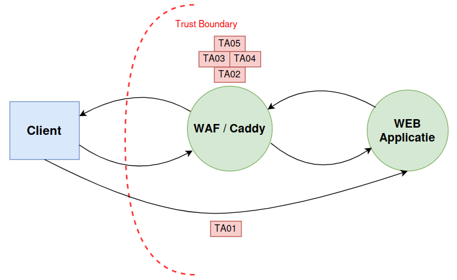
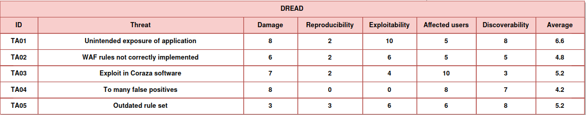
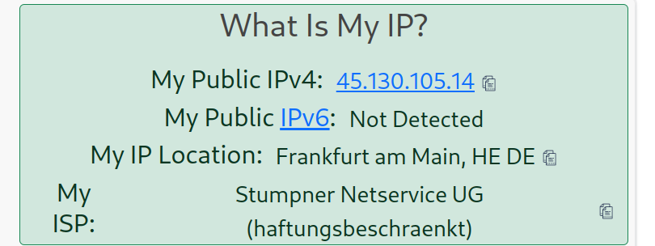
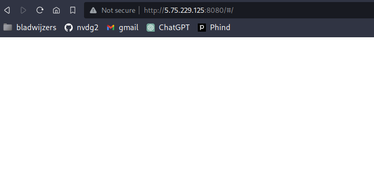
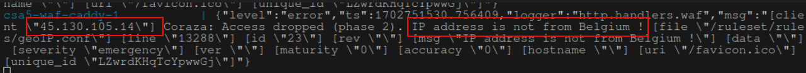
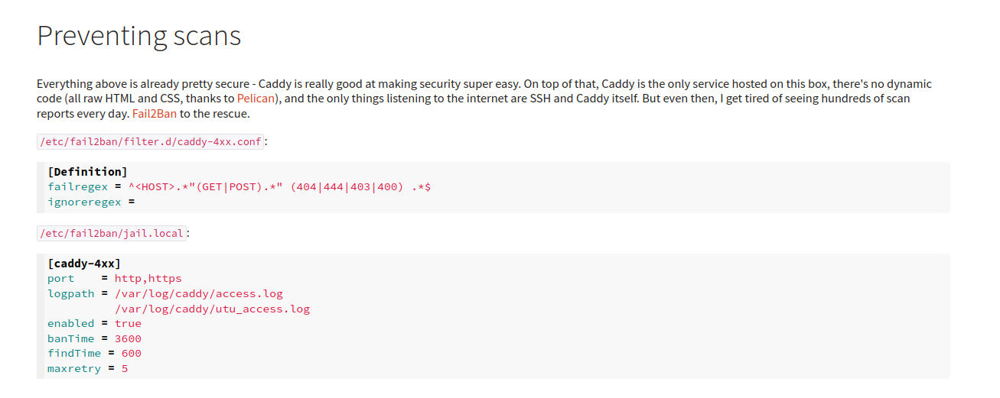

# CS5-WAF

_Link naar repository: [https://github.com/nvdg2/CSA5-WAF](https://github.com/nvdg2/CSA5-WAF)_

_Link naar coraza/caddy fork: [https://github.com/nvdg2/coraza-daddy-revenge](https://github.com/nvdg2/coraza-daddy-revenge)_

## Externe bronnen

Tutorial gebruikt van: [jptosso](https://medium.com/@jptosso/oss-waf-stack-using-coraza-caddy-and-elastic-3a715dcbf2f2)
Tips voor Geo IP gekregen van: Jasper Van meel

## Threat model




<div style="page-break-after: always; visibility: hidden">
\pagebreak
</div>

## Projectstructuur

Voor ons project hebben we twee repositories voorzien: één repo bevat een aangepaste versie van de [coraza caddy repo](https://github.com/corazawaf/coraza-caddy) en de andere repository bevat alle regels en docker compose files om eenvoudig een coraza-caddy-juiceshop omgeving op te zetten.

De `Dockerfile` maakt gebruik van onze eerste repo om een caddy container te bouwen met daarin alle plugins en dependencies. Deze container wordt gebruik in de `docker-compose.yml`.

De docker-compose.yml start een omgeving op met daarin twee containers: eerst onze Coraza-Caddy container met daarachter een juiceshop applicatie. Deze applicatie wordt dus door onze WAF beschermd.

Onze Caddyfile bevat twee aparate handles: het normale webverkeer wordt via de Coraza WAF gestuurd en al het websocket verkeer verloopt via een aparte route naar de eindapplicatie.
De regels in Caddy worden via bind mounts in de omgeving ingeladen en zijn dus eenvoudig aan te passen zonder opnieuw een container te moeten bouwen.

## Setup

Voor het juist functioneren van onze repo moeten we de [Coraza GeoIP](https://github.com/corazawaf/coraza-geoip) plugin gebruiken. Er is ook een [Maxmind GeoIP database](https://www.maxmind.com/en/geoip-databases) nodig waarin IP's en landen gekoppeld worden. Deze mag door licentiecompatibiliteit niet in de repo zelf zitten.
Onze docker-compose gaat ervan uit dat dit bestand zich in de root van de repo bevindt en "dbGeoIpBlock.mmdb" heet.

<div style="page-break-after: always; visibility: hidden">
\pagebreak
</div>

## SQL injection

### Input van aanvaller

De onderstaande foto laat zien dat we proberen een injectieaanval uit te voeren:


Deze aanval werkt echter niet. De volgende console error verschijnt voor de gebruiker:


De onderstaande foto laat zien dat de SQL injectieaanval geblokkeerd wordt door de Web Application Firewall. SQL injectieaanvallen worden dus succesvol tegengehouden.


### Core regel met betrekking tot SQL injectie

```text
SecRule REQUEST_COOKIES|!REQUEST_COOKIES:/__utm/|!REQUEST_COOKIES:/_pk_ref/|REQUEST_COOKIES_NAMES|ARGS_NAMES|ARGS|XML:/* "@rx /\*!?|\*/|[';]--|--(?:[\s\v]|[^\-]*?-)|[^&\-]#.*?[\s\v]|;?\x00" \
    "id:942440,\
    phase:2,\
    block,\
    capture,\
    t:none,t:urlDecodeUni,\
    msg:'SQL Comment Sequence Detected',\
    logdata:'Matched Data: %{TX.0} found within %{MATCHED_VAR_NAME}: %{MATCHED_VAR}',\
    tag:'application-multi',\
    tag:'language-multi',\
    tag:'platform-multi',\
    tag:'attack-sqli',\
    tag:'OWASP_CRS',\
    tag:'capec/1000/152/248/66',\
    tag:'PCI/6.5.2',\
    tag:'paranoia-level/2',\
    ver:'OWASP_CRS/4.0.0-rc2',\
    severity:'CRITICAL',\
    chain"
    SecRule MATCHED_VARS "!@rx ^ey[\-0-9A-Z_a-z]+\.ey[\-0-9A-Z_a-z]+\.[\-0-9A-Z_a-z]+$" \
        "t:none,\
        setvar:'tx.inbound_anomaly_score_pl2=+%{tx.critical_anomaly_score}',\
        setvar:'tx.sql_injection_score=+%{tx.critical_anomaly_score}'"
```

De volgende regel bevat een complexe reguliere expressie om SQL injectiepatronen te herkennen.

```text
SecRule MATCHED_VARS "!@rx ^ey[\-0-9A-Z_a-z]+\.ey[\-0-9A-Z_a-z]+\.[\-0-9A-Z_a-z]+$"
```

Er wordt een kritieke anomaliescore aan het verzoek van de gebruiker gegeven als zijn input voldoet aan de reguliere expressie. Dit betekent namelijk dat de kans groot is dat de gebruiker een SQL injectie uitvoert. In het bestand, waar deze regel is gedefinieerd, worden enkel SQL injecties opgesomd die hierdoor worden gedetecteerd:

```text
# ‘ or 1=1#
# ‘ or 1=1-- -
# ‘ or 1=1/*
# ' or 1=1;\x00
# ' /*!50000or*/1='1
# ' /*!or*/1='1
# 0/**/union/*!50000select*/table_name`foo`/**/
```

Zoals u ziet, zijn de eerste drie voorbeelden heel gelijkaardig aan de injectie die wij hebben uitgevoerd.

<div style="page-break-after: always; visibility: hidden">
\pagebreak
</div>

## Cross site scripting

### Input van de aanvaller

Onderstaande foto laat zien dat we in enkele velden XSS syntax hebben geplaatst. De aanvaller hoopt uiteraard dat dit iFrame wordt geparsed door de browser.


<div style="page-break-after: always; visibility: hidden">
\pagebreak
</div>

### Log van Web Application Firewall XSS

De aanvaller krijgt echter onderstaande console error te zien:


In onze applicatie zien we dat Coraza succesvol een XSS aanval heeft gedetecteerd en tegengehouden.


De XSS aanval triggerde de volgende regel in het REQUEST-941-APPLICATION-ATTACK-XSS.conf bestand:

```text
SecRule REQUEST_COOKIES|!REQUEST_COOKIES:/__utm/|REQUEST_COOKIES_NAMES|ARGS_NAMES|ARGS|REQUEST_FILENAME|XML:/* "@rx (?i)\b(?:eval|set(?:timeout|interval)|new[\s\v]+Function|a(?:lert|tob)|btoa)[\s\v]*\(" \
    "id:941390,\
    phase:2,\
    block,\
    capture,\
    t:none,t:htmlEntityDecode,t:jsDecode,\
    msg:'Javascript method detected',\
    logdata:'Matched Data: %{TX.0} found within %{MATCHED_VAR_NAME}: %{MATCHED_VAR}',\
    tag:'application-multi',\
    tag:'language-multi',\
    tag:'attack-xss',\
    tag:'xss-perf-disable',\
    tag:'paranoia-level/1',\
    tag:'OWASP_CRS',\
    tag:'capec/1000/152/242',\
    ver:'OWASP_CRS/4.0.0-rc2',\
    severity:'CRITICAL',\
    setvar:'tx.xss_score=+%{tx.critical_anomaly_score}',\
    setvar:'tx.inbound_anomaly_score_pl1=+%{tx.critical_anomaly_score}'"
```

## GeoIp block

### Buitelandse gebruiker bezoekt site



Bovenstaande foto laat zien dat we gebruik maken van een Duits IP-adres om de geo IP van onze WAF te testen.



Zoals u kan zien, kunnen we via dit IP-adres geen verbinding maken met de site. De onderstaande foto laat ook zien dat door Coraza succesvol het Duits IP-adres wordt geblokkeerd.



### Core regel met betrekking tot GeoIP

De volgende regels zorgen ervoor dat de verbinding wordt gedropt indien het adres van de gebruiker niet aan België is gelinkt.

```text
SecRule REMOTE_ADDR "@geoLookup" "chain,id:23,drop,msg:'IP address is not from Belgium !'"
SecRule GEO:COUNTRY_CODE "!@streq BE"
```

### De weg naar GeoIP

De eerste drie weken hebben Tom en ik ons uiterste best gedaan om Geo IP werkende te krijgen. Dit bleek echter  moeilijker te zijn dan eerder verwacht, aangezien geo ip na versie 3 niet meer via een ingebouwde regel toegankelijk is.

In plaats daarvan kan je via een Coraza plugin geo IP functionaliteiten toevoegen aan de WAF. Dit is "eenvoudig" te doen wanneer Coraza native draait, maar dit wordt complexer wanneer Coraza vooraf wordt gebouwd (wat bij ons het geval is).

Na een twee uur lange debug sessie met mijnheer Boeynaems hebben we besloten om onze eigen fork van de coraza/caddy repository te maken en de plugin hieraan toe te voegen.

Opnieuw was dit een grotere uitdaging dan verwacht en is dit toen jammer genoeg niet gelukt. Desondanks willen we laten zien welke acties wij op dat moment hebben genomen en met welke problemen we werden geconfronteerd.

<div style="page-break-after: always; visibility: hidden">
\pagebreak
</div>

### Forken van de repo

Eerst hebben we de repo geforked en probeerden we de geo plugin te installeren via de [officiële syntax](https://github.com/corazawaf/coraza-geoip). Het eerste probleem was dat de documentatie geen specifiek doelbestand aangaf en dat het een trail en error proces was vooraleer we progressie maakten.


### Bouwproces

Tijden het bouwproces zaten we opnieuw vast. Onze wijzigingen in de repo werden niet doorgevoerd. Na enige tijd zoeken, ondervonden we dat er in onze fork vaak werd verwezen naar de originele repository.

We hebben in alle bestanden elke referentie van de originele repo naar onze eigen fork veranderd. Dit bleek het probleem op het eerste zicht op te lossen.

### Regels werkende krijgen

Toen de fork correct was gebouwd, begonnen we met het implementeren van de geo IP regel. Hierop liepen we jammer genoeg vast: we kregen telkens de foutmelding dat de IP lookup geen resultaten terug gaf.


We hebben verschillende varianten van regels uitgeprobeerd, zoals u hieronder kan zien.

Variant 1:


Variant 2:


Het was moelijk om de regels op te stellen door de beperkte kennis die wij hadden over de regelsyntax. De **officiële documentatie** bevatte namelijk **outdated** info. De laatste versie (versie 4) heeft namelijk andere syntax regels dan versie 3. Daarom hadden we zeer vaak problemen met volgende error:


We moesten gebruik maken van TX, maar dit brak vaak de logica die sommige regels nodig hadden.

### Einde van geo IP

Tot slot besloten we om dezelfde regels te testen op een build die geen gebruik maakt van onze fork. Wat bleek: dezelfde errors traden op. We konden hieruit besluiten dat de build niet succesvol was en de plugin niet was geïnstalleerd.

Jammer genoeg was onze inspiratie ten einde en hebben we besloten om onze kans te wagen bij het beschermen tegen brute forcen. Later heeft Jasper ons een nieuwe start gegeven zodat we er uiteindelijk toch in geslaagd zijn om Geo IP aan onze docker omgeving toe te voegen.

<div style="page-break-after: always; visibility: hidden">
\pagebreak
</div>

## Troubleshooting Brute force

We zijn aan dit deel met goede moed begonnen. We vonden enkele implementaties van DOS bescherming in de [officiële documentatie](https://coraza.io/docs/seclang/variables/) en [onofficiële voorbeelden](https://docs.mirantis.com/mcp/q4-18/mcp-security-best-practices/use-cases/brute-force-prevention/create-brute-force-rules.html)

Niet officiële:


Officiële:


Er trad al snel een herkenbaar probleem op:


Zelfs wanneer we de officiële syntax gebruikten van Coraza, letterlijk knippen en plakken, traden er syntax problemen op. We spreken over onder andere de volgende code snippet:

```text
SecAction phase:1,id:109,initcol:ip=%{REMOTE_ADDR},nolog SecRule ARGS:login "!^$" "nolog,phase:1,id:110,setvar:ip.auth_attempt=+1,deprecatevar:ip.auth_attempt=25/120" SecRule IP:AUTH_ATTEMPT "@gt 25" "log,drop,phase:1,id:111,msg:'Possible Brute Force Attack'"
```

Na opnieuw veel trial en error, is het ons jammer genoeg toch niet gelukt om de regel succesvol te implementeren.

## CRSF

CSRF zit, voor zover we weten, niet meer in de "Core ModSecurity Rule Set". De laatste versie die we vonden, was V2.2.9. Helaas is deze versie niet compatible met de huidige versie van Coraza. Deze regels hebben we wel bijgevoegd in onze repository, maar deze staan apart in de `ruleset/unusedRules` folder.

## Repeat offenders

Om repeat offenders correct te blokkeren, zijn momenteel nog niet alle benodigde functies beschikbaar in Coraza. 

Volgens de documentatie zou bijvoorbeeld **expirevar** al moeten werken, maar in de broncode is dit duidelijk nog niet geïmplementeerd. Daarom stellen we voor om bijvoobeeld fail2ban te gebruiken om de logs te kunnen bekijken en mogelijke acties hierop te laten nemen.

We hebben deze functionaliteit echter niet geïmplementeerd omdat we voor een container approach zijn gegaan en dit hier niet mogelijk is.



## Besluit troubleshooting en lessons learned

Coraza is zonder twijfel een zeer krachtige Web Application Firewall en is daarnaast zeer aanpasbaar. Met de juiste kennis kan je regels zelf schrijven en met behulp van plugins zijn de mogelijkheden bijna eindeloos.

Een minpunt van Coraza is de mate van activiteit van de community en het documenteren. Wanneer Google het moeilijk heeft met zoekopdrachten zoals `coraza brute force protection`, weet je dat er een uitdaging te wachten staat.

Tom en ik hebben echter veel geleerd tijdens het opstellen van deze WAF. Hierna vindt u enkele conclusies terug:

- **Met de juiste kennis** kunnen Coraza plugins eenvoudig via Go geïnstalleerd worden, wat de firewall eenvoudig uitbreidbaar maakt.
- Documentatie is de sleutel voor elk project. In dit project hebben we allebei gemerkt dat het goed documenteren én up-to-date houden van  documentatie heel belangrijk is.
- Het is ons opgevallen dat de verschillende versies van Coraza niet backwards compatible zijn. Dit was een extra uitdaging waarmee rekening gehouden moest worden.


----

Niels Van De Ginste
Tom Goedemé
