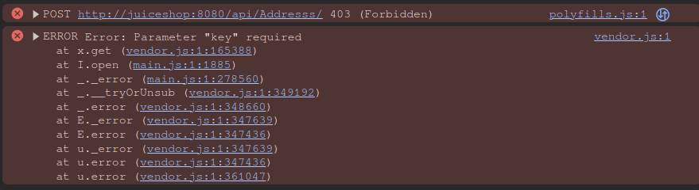

# CS5-WAF

_Link naar repository: [https://github.com/nvdg2/CSA5-WAF](https://github.com/nvdg2/CSA5-WAF)_

_Link naar coraza/caddy fork: [https://github.com/nvdg2/coraza-daddy-revenge](https://github.com/nvdg2/coraza-daddy-revenge)_

## Externe bronnen

Tutorial gebruikt van: [jptosso](https://medium.com/@jptosso/oss-waf-stack-using-coraza-caddy-and-elastic-3a715dcbf2f2)

Dankzij klasgenoot Jasper van Meel hebben we onze GeoIP module werkende gekregen om deze daarna in onze docker omgeving toe tevoegen.

## Threat model

THREAT MODEL HIER NOG PLAATSEN

## SQL injection

### Input van aanvaller

De onderstaande foto laat zien dat wr proberen een injectie aanval uit te voeren:


### Log van Web Application Firewall SQLi

Deze aanval werkt echter niet. De volgende console error verschijnt voor de gebruiker:


Zoals u op de bovenstaande foto's kan zien, wordt de SQL injectieaanval geblokkeerd door de Web Application Firewall.
SQL injectie wordt dus succesvol tegengehouden.

### Core regel met betrekking tot SQL injectie

```text
SecRule REQUEST_COOKIES|!REQUEST_COOKIES:/__utm/|!REQUEST_COOKIES:/_pk_ref/|REQUEST_COOKIES_NAMES|ARGS_NAMES|ARGS|XML:/* "@rx /\*!?|\*/|[';]--|--(?:[\s\v]|[^\-]*?-)|[^&\-]#.*?[\s\v]|;?\x00" \
    "id:942440,\
    phase:2,\
    block,\
    capture,\
    t:none,t:urlDecodeUni,\
    msg:'SQL Comment Sequence Detected',\
    logdata:'Matched Data: %{TX.0} found within %{MATCHED_VAR_NAME}: %{MATCHED_VAR}',\
    tag:'application-multi',\
    tag:'language-multi',\
    tag:'platform-multi',\
    tag:'attack-sqli',\
    tag:'OWASP_CRS',\
    tag:'capec/1000/152/248/66',\
    tag:'PCI/6.5.2',\
    tag:'paranoia-level/2',\
    ver:'OWASP_CRS/4.0.0-rc2',\
    severity:'CRITICAL',\
    chain"
    SecRule MATCHED_VARS "!@rx ^ey[\-0-9A-Z_a-z]+\.ey[\-0-9A-Z_a-z]+\.[\-0-9A-Z_a-z]+$" \
        "t:none,\
        setvar:'tx.inbound_anomaly_score_pl2=+%{tx.critical_anomaly_score}',\
        setvar:'tx.sql_injection_score=+%{tx.critical_anomaly_score}'"

```

De volgende regel bevat een complexe reguliere expressie.

```text
SecRule MATCHED_VARS "!@rx ^ey[\-0-9A-Z_a-z]+\.ey[\-0-9A-Z_a-z]+\.[\-0-9A-Z_a-z]+$"
```

Er wordt een kritieke anomalie score aan het verzoek van de gebruiker gegeven indien zijn input voldoet aan de reguliere expressie.  Dit betekent namelijk dat de kans groot is dat de gebruiker een SQL-injectie uitvoert. In het bestand waar deze regel is gedefinieerd, worden enkel SQL injecties opgesomd die hierdoor worden gedetecteerd:

```text
# ‘ or 1=1#
# ‘ or 1=1-- -
# ‘ or 1=1/*
# ' or 1=1;\x00
# 1='1' or-- -
# ' /*!50000or*/1='1
# ' /*!or*/1='1
# 0/**/union/*!50000select*/table_name`foo`/**/
```

Zoals u ziet, zijn de eerste drie voorbeelden heel gelijkaardig aan de injectie die wij hebben uitgevoerd.

## Cross site scripting

### Input van de aanvaller

De onderstaande foto laat zien dat we in enkele velden XSS syntax hebben geplaatst. De aanvaller hoopt uiteraard dat dit iFrame wordt geparsed door de browser.


### Log van Web Application Firewall XSS

De aanvaller krijgt echter de onderstaande console error te zien:



In onze applicatie zien we dat Coraza succesvol een XSS aanval heeft gedetecteerd en tegengehouden.


De XSS aanval triggerde de volgende regel in het REQUEST-941-APPLICATION-ATTACK-XSS.conf bestand:

```text
SecRule REQUEST_COOKIES|!REQUEST_COOKIES:/__utm/|REQUEST_COOKIES_NAMES|ARGS_NAMES|ARGS|REQUEST_FILENAME|XML:/* "@rx (?i)\b(?:eval|set(?:timeout|interval)|new[\s\v]+Function|a(?:lert|tob)|btoa)[\s\v]*\(" \
    "id:941390,\
    phase:2,\
    block,\
    capture,\
    t:none,t:htmlEntityDecode,t:jsDecode,\
    msg:'Javascript method detected',\
    logdata:'Matched Data: %{TX.0} found within %{MATCHED_VAR_NAME}: %{MATCHED_VAR}',\
    tag:'application-multi',\
    tag:'language-multi',\
    tag:'attack-xss',\
    tag:'xss-perf-disable',\
    tag:'paranoia-level/1',\
    tag:'OWASP_CRS',\
    tag:'capec/1000/152/242',\
    ver:'OWASP_CRS/4.0.0-rc2',\
    severity:'CRITICAL',\
    setvar:'tx.xss_score=+%{tx.critical_anomaly_score}',\
    setvar:'tx.inbound_anomaly_score_pl1=+%{tx.critical_anomaly_score}'"
```

## GeoIp block

Voor het juist functioneren van onze repo is een Maxmind Country ip nodig, deze mag door licientie compatibiliteit niet in de repo zelf zitten.

### Troubleshooting

De voorbije twee weken hebben Tom en ik ons uiterste best gedaan om Geo IP werkende te krijgen. Dit bleek echter veel moeilijker te zijn dan eerder verwacht, aangezien geo ip na versie 3 niet meer via een regel te gebruiken is.

In plaats daarvan kan je via een Coraza plugin geo IP functionaliteiten toevoegen een de WAF. Dit is "eenvoudig" te doen wanneer Coraza native draait, maar dit wordt complexer wanneer Coraza vooraf wordt gebouwd (wat bij ons het geval is).

Na een twee uur lange debug sessie met mijnheer Boeynaems hebben we besloten om onze eigen fork van de coraza/caddy repository te maken en de plugin hieraan toe te voegen.

Opnieuw was dit een grotere uitdaging dan verwacht en is dit jammer genoeg niet gelukt. Desondanks willen we laten zien welke stappen we hebben doornomen en tegen welke problemen we zijn aangekomen.

### Forken van de repo

Als eerst hebben we dus de repo geforked en probeerden we de geo plugin te installeren via de [officiële syntax](https://github.com/corazawaf/coraza-geoip). Het eerste probleem was dat de documentatie geen specifiek doelbestand aangaf en dat het een trail en error proces was vooraleer we progressie maakten.


### Bouwproces

Tijden het bouwproces zaten we opnieuw vast. Onze wijzigingen in de repo werden niet doorgevoerd. Na enige tijd te zoeken, ondervonden we dat er in onze fork vaak werd verwezen naar de originele repository.

We hebben in alle files elke referentie verandert  door een referentie naar onze eigen fork. Dit bleek het probleem op het eerste zicht op te lossen.

### Regels werkende krijgen

Toen de fork correct was gebouwd, begonnen we met het implementeren van de geo IP regel. Hierop liepen we jammer genoeg definitief vast: we krijgen telkens de foutmelding dat de IP lookup geen resultaten terug gaf.


We hebben verschillende varianten van regels uitgeprobeerd, zoals u hieronder kan zien.

Variant 1:


Variant 2:


Tijdens het maken van deze regels waren we heel beperkt moet onze kennis. De **officiële documentatie** bevatte namelijk **outdated** info. De laatste versie (versie 4) heeft namelijk andere syntax regels dan versie 3. Daarom hadden we zeer vaak problemen met de volgende error:


We moesten gebruik maken van TX, maar dit brak vaak de logica die sommige regels nodig hadden.

### Einde van geo IP

Tot slot besloot een van ons om dezelfde regels te testen op een build die geen gebruik maakt van onze fork. Wat bleek: dezelfde errors traden op. We konden hieruit besluiten dat de build niet succesvol was en de plugin niet was geïnstalleerd.

Jammer genoeg was onze inspiratie hier ten einde en hebben we besloten om onze kans te wagen bij het beschermen tegen brute forcen.

## Troubleshooting Brute force

We zijn aan dit deel begonnen met goede moed. We vonden enkele implementaties van DOS bescherming in de [officiële documentatie](https://coraza.io/docs/seclang/variables/) en [onofficiële voorbeelden](https://docs.mirantis.com/mcp/q4-18/mcp-security-best-practices/use-cases/brute-force-prevention/create-brute-force-rules.html)

We hebben twee varianten uitgeprobeerd van de DOS bescherming: een officiële en een niet officiële variant. Beide kan u hieronder terugvinden

Niet officiële:


Officiële:


Er trad al snel een herkenbaar probleem op:


Zelf wanneer we de officiële syntax gebruikte van Coraza, letterlijk knippen en plakken, traden er syntax problemen op. We spreken over de volgende code snippet:

```text
SecAction phase:1,id:109,initcol:ip=%{REMOTE_ADDR},nolog SecRule ARGS:login "!^$" "nolog,phase:1,id:110,setvar:ip.auth_attempt=+1,deprecatevar:ip.auth_attempt=25/120" SecRule IP:AUTH_ATTEMPT "@gt 25" "log,drop,phase:1,id:111,msg:'Possible Brute Force Attack'"
```

Na opnieuw veel trail en error, is het ons ook deze keer jammer genoeg niet gelukt om  de regel succesvol te implementeren.

## Besluit troubleshooting en geleerde lessen

Coraza is zonder twijfel een zeer krachtige Web Application Firewall en is daarnaast zeer aanpasbaar. Met de juiste kennis kan je regels zelf schrijven en met behulp van plugins zijn de mogelijkheden bijna eindeloos.

Echter, een zware valkuil van deze toepassing is de activiteit van de community en de documentatie. Wanneer google het moeilijk heeft met zoekopdrachten zoals `coraza brute force protection`, weet je dat er een uitdaging te wachten staat.

Tom en ik hebben echter veel geleerd tijdens het zoeken naar een mogelijke oplossing. Deze willen we dan ook graag met u delen:

- Met de juiste kennis kunnen Coraza plugins eenvoudig via Go geïnstalleerd worden, wat de firewall eenvoudig uitbreidbaar maakt.
- NOG EENTJE TOM
- NOG EENTJE TOM

Om dit project af te ronden, willen we eindigen met een toepasselijke quote:

**_“Losing is essential to anyone’s success. The more you lose, the more you want to win.” - Brett Hull_**
